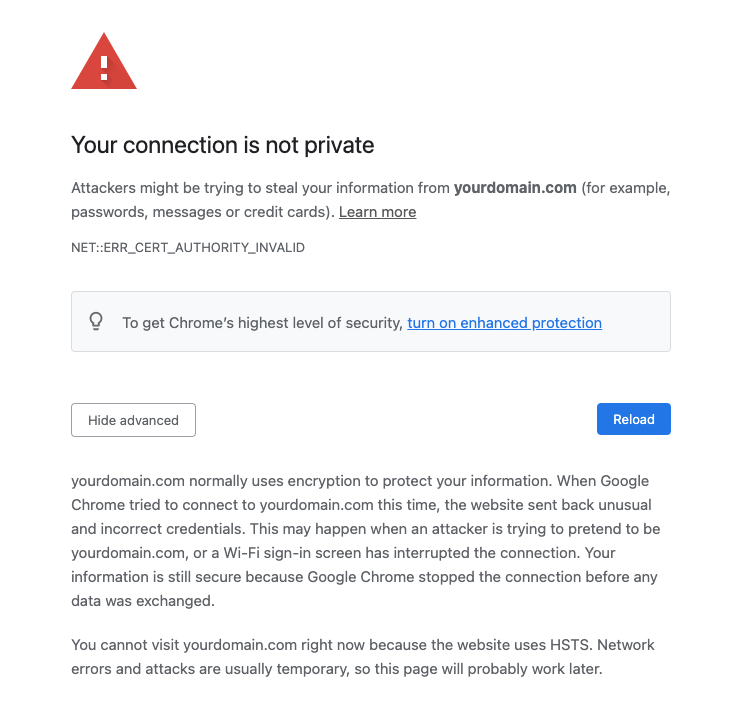
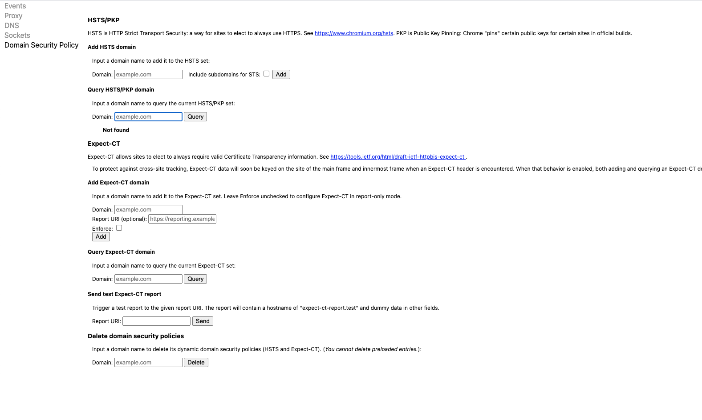

# Charles Proxy and HSTS (chrome)

## The error

If you run a (local) proxy and you get a warning :

|You cannot visit yourdomain.com right now because the website uses HSTS.  Network errors and attacks are usually temporary, so this page will probably work later.

## bypassing the warning in chrome

### Go to the chrome settings for hsts:

[chrome://net-internals/#hsts](chrome://net-internals/#hsts)

1. Enter the domain in the field **Query HSTS/PKP domain**

*you should get a list of stuff related to this domains security policies*

If you know what you are doing ( :warning:  don't do this in the airport on "free wifi" :warning: )

2. Enter the domain in the field: **Delete domain security policies**

Make sure that it actually deleted the entries by going back to step 2

If succesfull, reload the actual webpage. The error changes to warn you that the certificate is incorrect (which you can accept)

3. Undo the bypass (when you are done!) by adding the domain via **Add HSTS domain**

Once you are done with your proxy-testing make sure to bring back the original settings of HSTS
Check via step 1 and reloading the page to see the original error.

